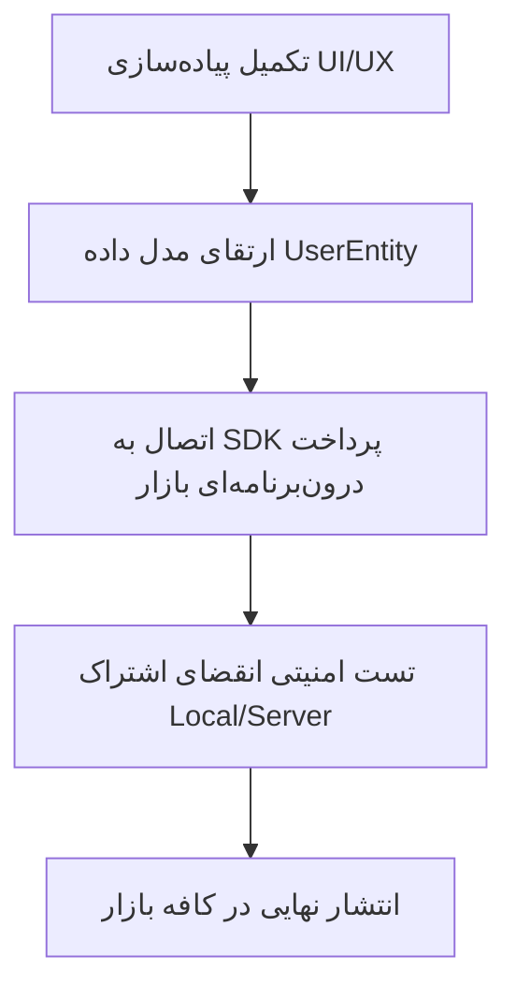

# 📖 طرح جامع درآمدزایی و استراتژی انتشار در کافه بازار
### اپلیکیشن هوشمند قرآن کریم (نسخه تجاری و کاربردی)

> **وضعیت سند:** نهایی و آماده ارائه  
> **مخاطب:** تیم توسعه، سرمایه‌گذاران و مدیران محصول  
> **حوزه فعالیت:** کافه بازار (Android Market)  

---

## 📌 ۱. چکیده مدیریتی (Executive Summary)

سند حاضر، استراتژی تجاری‌سازی و درآمدزایی **«اپلیکیشن جامع قرآن کریم»** را برای عرضه در مارکت کافه بازار تبیین می‌کند. 

با توجه به حساسیت‌های ویژه در اپلیکیشن‌های مذهبی، استراتژی اتخاذشده بر پایه **مدل فری‌میوم ترکیبی (Hybrid Freemium)** استوار است. در این مدل:
1. **هسته اصلی برنامه** (متن قرآن، ترجمه پایه و زمان‌بندی اذان) به صورت **۱۰۰٪ رایگان و بدون تبلیغات** ارائه می‌شود تا رضایت حداکثری کاربران و امتیاز ۵ ستاره جلب گردد.
2. **خدمات پرهزینه و تخصصی** (دانلود انبوه صوت قاریان، رنگ‌آمیزی اختصاصی اعراب، واژه‌شناسی لغت‌به‌لغت، ترجمه صوتی فارسی و اتصال سخت‌افزاری) در قالب **اشتراک ویژه (VIP)** و **طرح‌های نذر فرهنگی** تجاری‌سازی می‌شوند.

---

## 📊 ۲. ماتریس دسترسی و سطح‌بندی امکانات (Access Matrix)

جدول زیر تفکیک دقیق دسترسی کاربران عادی و کاربران دارای اشتراک VIP را نشان می‌دهد:

| عنوان امکانات / بخش | سطح دسترسی | نحوه ارائه و سیاست اجرا |
| :--- | :---: | :--- |
| **متن کامل ۶۰۴ صفحه قرآن** | 🟢 **رایگان دائمی** | بدون محدودیت برای تمام کاربران |
| **یک ترجمه متنی پایه (مکارم / فولادوند)** | 🟢 **رایگان دائمی** | بدون محدودیت برای تمام کاربران |
| **تنظیمات پایه خواندن (سایز، تم روز/شب)** | 🟢 **رایگان دائمی** | ابزارهای ضروری مطالعه |
| **اوقات شرعی و اذان‌گوی پایه** | 🟢 **رایگان دائمی** | محاسبه دقیق افق‌ها + ۱ صدای اذان شاخص |
| **صوت کامل قاری مرجع (استاد پرهیزگار)** | 🟢 **رایگان دائمی** | دانلود و پخش نامحدود کل ۱۱۴ سوره قرآن برای تمام کاربران |
| **آرشیو سایر قاریان برجسته (عبدالباسط و...)** | 🔴 **اختصاصی VIP** | سوره حمد و ۴ سوره پایانی رایگان (دمو) + مابقی نیازمند VIP |
| **ترجمه لغت‌به‌لغت (واژه‌شناسی)** | 🟡 **حالت دمو** | **سوره حمد + ۱۰ آیه اول سوره بقره رایگان**، مابقی نیازمند VIP |
| **تنظیمات لوکس (رنگ اعراب، فونت ثلث و...)** | 🔴 **تست ۳ روزه (VIP)** | آیکون تاج VIP + امکان فعال‌سازی مهلت تست ۳ روزه رایگان |
| **ترجمه صوتی فارسی (گویا)** | 🔴 **اختصاصی VIP** | دسترسی کامل تنها با خرید اشتراک |
| **اتصال به سخت‌افزار هوشمند (NodeMCU)** | 🔴 **اختصاصی VIP** | همگام‌سازی با نمایشگر OLED (کد هدیه روی جعبه سخت‌افزار) |
| **طرح نذر و حمایت مالی قرآنی** | 💚 **پرداخت اختیاری** | پرداخت دلخواه + اعطای **اشتراک VIP هدیه** به حامیان |

---

## 🔍 ۳. تشریح تفصیلی سیاست‌ها و نرخ تبدیل (Conversion Strategy)

> [!TIP]
> **اصل طلایی:** کاربر باید یک تجربه قرآنی کامل و بدون بن‌بست داشته باشد (قاری مرجع رایگان)، اما برای تنوع صوتی و قاریان شاخص بین‌المللی ارزش ویژه اشتراک VIP را احساس کند.

### ۳.۱. مدل دسترسی صوتی (قاری مرجع رایگان + سایر قاریان VIP)
* **قاری پایه و مرجع (۱۰۰٪ رایگان):** ترتیل آموزشی و رسمی **استاد شهریار پرهیزگار** برای تمامی ۱۱۴ سوره قرآن به صورت کاملاً رایگان و بدون هیچ محدودیتی در اختیار همه کاربران قرار دارد تا هیچ کاربری بدون صوت نماند و ارزش معنوی برنامه حفظ شود.
* **آرشیو سایر قاریان برجسته (مخصوص VIP):** قاریان شاخص جهان اسلام (مانند استاد عبدالباسط، منشاوی، خلیل الحصری، مشاری العفاسی، سعد الغامدی و...) در رده VIP قرار می‌گیرند.
* **حالت دمو برای تست سایر قاریان:** جهت آشنایی و ارزیابی کیفیت صدا، **سوره حمد و ۴ سوره پایانی قرآن (اخلاص، فلق، ناس و کافرون)** برای تمام قاریان باز است.
* **انگیزه خرید:** هنگام انتخاب سایر قاریان برای سوره‌های دیگر، دیالوگ لوکس معرفی اشتراک باز می‌شود:
  > *"ترتیل استاد پرهیزگار برای تمام قرآن رایگان است. برای استفاده از صدای دلنشین استاد عبدالباسط و بیش از ۲۰ قاری برجسته دیگر، اشتراک VIP را فعال کنید."*

---

### ۳.۲. ترجمه لغت‌به‌لغت و ریشه‌شناسی کلمات (نمونه دمو)
* **مکانیزم:** جهت آشنایی کاربر با ارزش علمی این ویژگی، **سوره حمد و ۱۰ آیه اول سوره بقره** کاملاً باز است.
* **ارائه در سایر سوره‌ها:** هنگام تپ روی کلمات در بقیه قرآن، مدال پیش‌نمایش قفل‌دار با افکت شیشه‌ای (Blurred) باز شده و ارزش کاربردی واژه‌شناسی تبیین می‌گردد.

---

### ۳.۳. تنظیمات لوکس قرائت (اعراب رنگی و فونت‌ها + مهلت تست ۳ روزه)
* **امکانات پایه (رایگان):** اندازه قلم، تم روز/شب، فونت استاندارد Vazirmatn.
* **امکانات لوکس (مخصوص VIP):**
  * تغییر رنگ اعراب (تَشکیل) به صورت جداگانه از متن.
  * دسترسی به فونت‌های اصیل خوشنویسی (ثلث، نیریزی، امیری قرآنی، نازنین).
  * حاشیه‌ها و قاب‌های تذهیب اختصاصی.
* **فرآیند فعال‌سازی بدون اصطکاک:**
  1. کنار تنظیمات لوکس، آیکون **تاج طلایی (VIP)** درج می‌شود.
  2. با کلیک کاربر، پیام پیشنهادی ظاهر می‌شود:
     > *"این امکان ویژه کاربران VIP است. آیا مایلید ۳ روز مهلت تست رایگان VIP را فعال کنید؟"*
  3. پس از تأیید، مهلت ۳ روزه شروع شده و پس از اتمام، سیستم به حالت پایه برمی‌گردد بدون اینکه کاربر احساس غافلگیری یا نارضایتی داشته باشد.

---

### ۳.۴. طرح حمایت مالی (نذر و وقف قرآنی)
برای کاربرانی که تمایل دارند به توسعه پروژه قرآنی کمک کنند، بخش **«نذر فرهنگی»** در نظر گرفته شده است:

* **بسته‌های حمایتی در کافه بازار:**
  * **حمایت برنزی (۵۰,۰۰۰ تومان)** 👈 هدیه: ۱ ماه اشتراک VIP
  * **حمایت نقره‌ای (۱۰۰,۰۰۰ تومان)** 👈 هدیه: ۳ ماه اشتراک VIP
  * **حمایت طلایی (۳۰۰,۰۰۰ تومان)** 👈 هدیه: ۱ سال اشتراک VIP
* **نتیجه:** کاربر حس انجام یک عمل خیر (وقف) را دارد و در عین حال پاداش اشتراک VIP دریافت می‌کند.

---

## 💳 ۴. پلن‌های قیمت‌گذاری در کافه بازار (Pricing Table)

قیمت‌گذاری بر اساس تحلیل رفتار خرید کاربران ایرانی در کافه بازار طراحی شده است:

| نام پلن | مدت زمان | قیمت | نرخ تخفیف | برچسب بازارگرمی و تمرکز فروش |
| :--- | :---: | :---: | :---: | :--- |
| **اشتراک برنزی** | ۱ ماهه | **۳۹,۰۰۰ تومان** | — | مناسب برای تست کوتاه مدت |
| **اشتراک نقره‌ای** | ۳ ماهه | **۸۹,۰۰۰ تومان** | ۲۵٪ | مناسب مناسبت‌ها (رمضان / محرم) |
| **اشتراک طلایی** | ۱ ساله | **۱۷۹,۰۰۰ تومان** | **۶۰٪** | 💥 **محبوب‌ترین پلن (پیشنهادی)** |
| **اشتراک مادام‌العمر** | دائمی | **۳۴۹,۰۰۰ تومان** | — | 🏆 دسترسی همیشگی و بی‌دردسر |

> [!IMPORTANT]
> **نکته کلیدی فروش:** پلن **۱ ساله (۱۷۹ هزار تومان)** به عنوان اقتصادی‌ترین گزینه با برچسب *"پیشنهاد ویژه"* برجسته می‌شود تا بیشترین نرخ تبدیل را ایجاد کند.

---

## 💬 ۵. متن پیام‌ها و دیالوگ‌های درون‌برنامه‌ای (UX Copywriting)

### پیام هنگام انتخاب قاریان ویژه (VIP):
> **عنوان:** 👑 آرشیو قاریان ویژه و منتخب جهان اسلام  
> **متن:** *"ترتیل استاد پرهیزگار برای تمام قرآن کاملاً رایگان است. برای دسترسی به صدای دلنشین استاد عبدالباسط، منشاوی، العفاسی، ترجمه گویای صوتی و بیش از ۲۰ قاری برجسته دیگر، اشتراک VIP را فعال کنید."*  
> **دکمه اصلی:** [ مشاهده پلن‌ها و ارتقا به VIP ] | **دکمه فرعی:** [ استفاده از قاری رایگان ]

### پیام فعال‌سازی تست ۳ روزه تنظیمات:
> **عنوان:** 👑 تجربه ۳ روز رایگان امکانات VIP  
> **متن:** *"رنگ‌آمیزی اختصاصی اعراب و فونت‌های خوشنویسی ثلث و نیریزی جزو امکانات VIP هستند. مایلید همین الان ۳ روز تست رایگان را فعال کنید؟"*  
> **دکمه اصلی:** [ فعال‌سازی ۳ روز تست رایگان ]

---

## 🚀 ۶. نقشه راه فنی و گام‌های بعدی (Technical Roadmap)

1. **ارتقای مدل داده کاربر (`UserEntity`):** افزودن فیلدهای `isVip` ،`vipExpiryDate` و `isTrialUsed`.
2. **اتصال به SDK بازار (Cafe Bazaar IAB):** پیاده‌سازی متدهای خرید اشتراک دوری (Subscription) و خریدهای مصرفی (برای نذر مالی).
3. **امنیت و ذخیره‌سازی محلی:** استفاده از `flutter_secure_storage` جهت جلوگیری از دستکاری تاریخ یا وضعیت اشتراک در گوشی‌های روت‌شده.

---
*سند حاضر جهت بررسی و تأیید نهایی تدوین گردیده است.*
